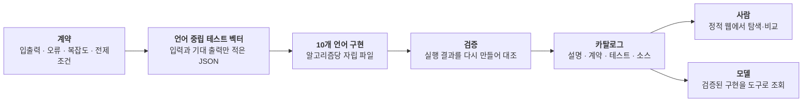
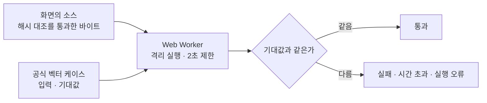

# SSW 알고리즘 아카이브

**알고리즘 500종을 10개 언어로 구현하고, 언어 중립 테스트 벡터로 5,000개 구현 전부가 같은
계약을 지키는지 확인한 아카이브입니다.** 이 사이트는 그중 8종을 잘라 낸 공개 스냅샷이고,
**JavaScript 구현은 화면에서 그대로 돌려 볼 수 있습니다** — 공식 테스트 벡터의 케이스를
입력으로 넣고, 결과가 그 케이스의 기대값과 같은지 브라우저가 그 자리에서 대조합니다.

아래는 그 아카이브가 어떻게 시작해서 어디서 멈췄는지에 대한 이야기입니다. 제품 계획에서
출발한 것이 아니라 궁금증 두 개로 가볍게 시작했고, 도중에 하나가 더 붙었고, **어디서
부러지는지**를 확인한 자리에서 멈췄습니다. 사이트에 무엇이 담겼는지부터 보고 싶다면
[6절](#6-그래서-이-사이트에-담긴-것)로 건너뛰어도 됩니다.

> **공개 사이트 주소** — https://s-work-agency.github.io/ssw-algorithm-archive-public/
> 이 저장소가 그대로 서빙됩니다.

---

## 1. 가볍게 시작했다

시작은 두 가지 궁금증이었습니다. 하나는 **이미 구현되고 검증된 코드를 참조하게 하면 오픈
웨이트 소형 모델이 그것을 얼마나 잘 활용할 수 있을까**, 다른 하나는 **이름만 알던 알고리즘을
이 기회에 제대로 알 수 있을까**였습니다. 둘 다 제품 기획이 아니라 취미에 가까운 질문이라,
처음에는 정말 가볍게 시작했습니다. 이 가벼움이 나중에 값을 치르게 되는데, 그 이야기는
[5절](#5-우선은-5000에서-멈춘다)에 있습니다.

첫 질문이 "참조"에서 출발한 데는 이유가 있습니다. 소형 모델은 알고리즘 코드를 빠르게 써
냅니다. 문제는 그다음입니다 — 그 코드가 맞는지 매번 사람이 다시 확인해야 하고, **확인 비용이
생성 비용보다 큽니다.** 같은 알고리즘을 다음 달에 또 물어보면 또 새로 짜 주고, 또 처음부터
확인해야 합니다. 그렇다면 **확인이 이미 끝난 코드를 손에 쥐여 주면 어떻게 되는가** — 첫
궁금증은 처음부터 이 모양이었습니다.

그래서 아카이브는 소형 모델의 산출물이 아니라 소형 모델이 **참조하는 자료**입니다. 모델에게
요구하는 능력이 "정확한 코드를 써 내는 것"에서 "상황에 맞는 항목을 고르는 것"으로 바뀌면,
작은 모델로도 성립하는 일이 됩니다.

헷갈리기 쉬운 자리라 미리 적어 둡니다 — **만드는 쪽과 쓰는 쪽은 다릅니다.** 계약을 적고
구현하고 검증해 아카이브를 채우는 일은 AI 도구를 여럿 붙여 진행했습니다. 소형 모델은 그렇게
완성된 아카이브를 **꺼내 쓰는 쪽**이고, 이 글에서 "소형 모델"은 늘 그쪽을 가리킵니다.

이 전제가 아카이브의 모양을 바로 결정했습니다. **한 알고리즘은 한 파일에 담고, 그 파일만
건네받아도 다른 파일 없이 동작해야** 합니다. 요청한 알고리즘 하나 대신 옆 알고리즘 열 개가
딸려 오는 응답은 쓸모가 없기 때문입니다. 그리고 아카이브에 없는 것을 물어보면 **없다고
말해야** 합니다 — 없는 것을 그럴듯하게 채워 주는 도구는 모델의 실수를 줄이는 게 아니라
늘립니다.

두 번째 궁금증도 같은 자리에서 답이 나왔습니다. 이름은 들어 봤지만 직접 써 본 적 없는
알고리즘이 목록의 절반이었는데, "검증된 것만 싣는다"를 지키려면 **무엇이 맞는지를 먼저
적어야** 했습니다. 겸사겸사 공부하려던 것이 등재 절차 자체가 된 셈입니다.

굴리는 방식도 가벼웠습니다. **다른 작업과 병행**하면서 **개요 수준의 기획만** 넘기고 알아서
진행하게 뒀고, 규모도 **알고리즘 100종 정도 × 3개 언어**를 **단일 저장소 하나**에 전부 넣는
형태였습니다. 이 시기가 얼마나 걸렸는지는 **재지 않았습니다** — 다른 일과 겹쳐 돌렸으니
애초에 계산이 되는 숫자가 아닙니다. 그런데 그렇게 던져 놓고 봤더니 되더라는 것이, 나중에
규모를 키워 볼 생각의 근거가 됐습니다.

---

## 2. 세 언어로 먼저 뚫었다

처음은 C# · Java · JavaScript 세 언어였습니다. 셋을 고른 데는 이유가 있습니다 — **정적
강타입 · JVM · 동적**이라는 축이 서로 충분히 달라서, 계약에 빈틈이 있으면 세 언어 사이에서
먼저 드러납니다. 열 개 언어로 한꺼번에 벌린 뒤에 계약을 고치면 고칠 곳이 열 배가 됩니다.

그 "계약"이 이 프로젝트에서 손이 가장 많이 간 물건입니다. 알고리즘 하나를 추가할 때 먼저
쓰는 건 구현이 아니라 **입력 · 출력 · 오류 코드 · 복잡도 · 전제조건**을 적은 문서입니다.
입력의 경계값은 어디까지인지, 실패하면 어떤 오류인지, 동점이면 누가 먼저인지, 출력의 순서에
의미가 있는지를 문장으로 확정해야 그다음 단계로 갑니다. "대충 안다"로는 한 종도 넘어가지
못합니다.

여기서 첫 소득이 나왔습니다. **안다고 생각한 것이 대부분 안 적힙니다.** 교과서 설명은 "최단
경로를 구한다"에서 끝나는데, 최단 경로가 여럿이면 어느 것을 돌려줄지는 아무도 말해 주지
않습니다. 구현마다 다르고, 그래서 언어마다 다릅니다.

계약을 먼저 적어 두면 그다음은 기계적으로 풀립니다.

순서가 뒤집히지 않는 것이 요점입니다. **구현이 먼저 나오고 테스트가 따라오면** 테스트는
구현이 이미 하는 일을 확인해 줄 뿐입니다. 벡터를 계약에서 먼저 뽑아 두면 구현이 거기에
맞춰야 합니다. 벡터는 언어를 모르기 때문에 열 개 언어가 같은 벡터를 씁니다 — 그래서
**"Java에서는 되는데 Python에서는 안 된다"가 말이 되지 않습니다.** 다르면 구현이 아니라
계약이 모호했던 것이므로 계약을 고칩니다.

검증의 정의도 이때 좁게 잡았습니다. 이 프로젝트에서 검증은 **테스트를 돌렸다**가 아니라
**결과 바이트가 그대로다**입니다. 언어별 러너가 벡터를 실행해 남긴 결과 문서를 저장소에
커밋해 두고, 검증할 때마다 **다시 생성해 커밋된 파일과 대조**합니다. 한 바이트라도 다르면
실패입니다. "테스트가 통과했다"가 아니라 **"동작이 예전과 완전히 같다"**를 증명하는
구조입니다.

이 정의를 세우고 나니 무엇을 실을 수 있는지도 함께 정해졌습니다. **실제 시계 · OS 난수 ·
스레드 없이 결정적으로 재현할 수 있는가** — 통과하지 못하는 후보는 넣지 않습니다. 대신
시간과 난수를 전부 호출자가 주입하게 만들어서, 캐시 만료나 재시도 지연처럼 시간에 기대는
알고리즘까지 결정적으로 검증되게 했습니다. 파이프라인의 상세는
[검증 파이프라인](docs/verification-pipeline.md)에 있습니다.

---

## 3. 그다음 궁금해진 것은 규모였다

계기는 솔직히 말하면 **예고된 주간 사용 한도 초기화**였습니다. 어차피 한도가 초기화되는
김에 한 번 스케일을 키워 볼까 하는 생각으로 본격적으로 붙었고, 그러면서 질문도 하나
늘었습니다 — **같은 일을 500종 × 10개 언어 = 5,000개 구현으로 벌리면 속도와 토큰이 얼마나
들까.** 앞의 둘과 달리 이건 해 보기 전에는 감이 전혀 없는 질문이라, 실제로 벌려 보는 것
말고는 답을 얻을 방법이 없었습니다.

그래서 **단일 저장소 하나에 전부 넣어 두던 구조를 언어별 저장소로 분할**하고, 알고리즘
100종 남짓을 500종으로, 3개 언어를 10개 언어로 한꺼번에 올렸습니다.

본편은 **약 3~4일**이었고 거의 **풀타임**으로 돌렸습니다. 켜 놓고 잠을 자기도 했습니다. 그
사이 사람 손이 간 곳은 거의 없습니다 — 메모리가 밀려 I/O가 너무 느려질 때 **한 번씩
재부팅**해 준 게 전부입니다.

정밀한 회계는 발표하지 않겠습니다. 여러 세대의 도구와 모델이 섞인 채로 진행됐기 때문에,
총 토큰이나 모델별 비교치를 하나의 숫자로 요약하면 실제보다 정확해 보이는 오해를 만듭니다.

그래도 자릿수로 말할 수 있는 관찰은 있습니다. **속도는 기대보다 빨랐습니다** — **알고리즘
100종을 뽑는 데 30분에서 한 시간** 정도였습니다. 그 안에 **사용 시나리오 작성 · 구현 ·
주석 · 테스트 코드 작성 · 그 테스트를 통과시키는 것까지** 다섯이 다 들어 있습니다. 늘
그렇지는 않았습니다. **어떤 모델을 쓰느냐에 따라 격차가 있었고**, 그래서 하나의 평균으로
뭉뚱그리기보다 "이 정도가 나오기도 했다"로 적어 둡니다.

---

## 4. 부러진 것은 기능이 아니라 통일성이었다

벌려 보니 비용이 예상과 다른 자리에 붙었습니다. **비싼 쪽은 기능이 아니었습니다.** 알고리즘이
무엇을 하는지를 코드로 옮기는 일은 대체로 금방 끝납니다. 시간도 토큰도 크게 든 쪽은 **열 개
언어의 구현을 서로 어긋나지 않게 맞추는 일**이었습니다.

언어가 열 개가 되는 순간 "이 언어에서는 이렇게 나오던데"라는 말이 통하지 않게 됩니다. 그리고
**계약이 정하지 않은 자리는 전부 언어의 기본값이 대신 결정해 버립니다.** 가장 자주 겪은 사고
유형이 이것이었습니다.

`lru-cache`의 capacity를 초기에 `"positive integer"`라고만 적었습니다. C#과 Java는 부호 있는
32비트로 막았고 JavaScript는 정수인지만 확인해서, **2147483648을 한쪽은 거절하고 한쪽은
받는** 상태가 생겼습니다. 계약이 모호하면 언어가 대신 정하고, 언어가 열 개면 그런 자리가 열
갈래로 갈립니다.

고치는 방법 자체는 어렵지 않습니다 — 경계값을 `"positive signed 32-bit integer (1 through
2147483647)"`처럼 **구간을 숫자로** 적으면 됩니다. 비싼 것은 고치는 일이 아니라 **뒤늦게
발견해 열 개 언어를 되짚는 일**입니다. 형태가 틀린 채로 다섯 개를 만들면 다섯 개를 다시
만들어야 합니다. 이런 자리를 미리 잠그는 관례들은
[검증 파이프라인](docs/verification-pipeline.md#3-계약을-설계할-때의-관례)에 모아 두었습니다.

구조를 통째로 갈아엎어야 했던 것도 있습니다. 초기 구현은 언어별로 여러 알고리즘을 묶음
파일에 모아 두는 구조였습니다. 빠르게 늘리기에는 좋았지만 **한 알고리즘을 꺼내 쓰려면 묶음
전체를 들고 가야 했고**, 그건 1절에서 정한 방향과 정면으로 어긋납니다. 그래서 열 개 언어
전부를 알고리즘당 1:1 자립 파일로 다시 나눴습니다. 수백 개 파일을 옮기는데 동작은 한 톨도
바뀌면 안 되는 작업이었고, 이걸 확인해 준 것이 앞서 좁게 잡아 둔 바이트 동일성입니다 —
작업 전후로 결과 파일이 **한 바이트도 달라지지 않았습니다.**

되짚는 횟수를 줄이려고 절차가 굳었습니다. **계약 먼저, 한 종 먼저, 세 언어 먼저**입니다. 새
알고리즘은 세 언어로 먼저 뚫고, 처음 보는 계약 형태를 만나면 한 종을 끝까지 검증한 뒤에
나머지로 확산했습니다. 작업을 나눠 맡은 AI 세션들에도 같은 이유의 규약을 걸었습니다 —
**구현과 검증을 다른 세션이 맡습니다.** 한 세션이 자기 코드를 검증하면 구현할 때 한 착각을
검증에서도 그대로 반복하는데, 테스트 벡터 자체가 산출물인 이 프로젝트에서는 그게 곧 "자기가
구현한 대로 통과하는 벡터"가 됩니다.

---

## 5. 우선은 5,000에서 멈춘다

500종 × 10개 언어 = 5,000개 구현에서 확장을 멈춥니다.

솔직하게 적어 두면 여기에는 **설계 판단의 몫**이 있습니다. 세 언어로 가볍게 시작해 놓고
대책 없이 규모를 키웠습니다. 언어가 셋일 때는 "계약이 애매하면 그때 가서 맞춘다"가 통했고,
그 방식을 열 개까지 그대로 끌고 갔습니다. 통일성을 유지하는 비용이 규모에 어떻게 붙는지는
이미 벌리고 난 뒤에 알았고, 4절의 절차들은 대부분 그 비용을 치르고 나서 사후에 굳힌
것입니다.

그래서 여기서 한 번 끊습니다. 얻으려던 건 개수가 아니라 **어디서 부러지는지**였고, 그 답은
이미 나왔습니다 — 검증된 자료를 쥐여 주면 소형 모델이 어디까지 활용하는지, 규모를 벌리면
무엇이 먼저 갈라지는지, 계약을 적는다는 게 실제로 무엇을 요구하는지. **5,000은 그 답을
얻으려고 치른 값이지 그 자체가 결론이 아닙니다.** 더 벌리는 일은 같은 답을 더 비싸게 다시
사는 쪽에 가깝습니다.

이 공개 스냅샷은 그 이야기가 무엇을 남겼는지 밖에서 볼 수 있게 잘라 낸 창구입니다.

---

## 6. 그래서 이 사이트에 담긴 것

공개 스냅샷에는 **알고리즘 8종 × 3개 언어(C# · Java · JavaScript) = 24개 구현**이 들어
있습니다. 각 알고리즘마다 설명 · 계약 · 실제 테스트 케이스 · 언어별 원본 소스를 한 화면에서
볼 수 있습니다.

| 알고리즘 | 분류 | 짝 |
|---|---|---|
| 퀵 정렬 | 정렬 | 비교 기반 정렬 |
| 버블 정렬 | 정렬 | 가장 단순한 비교 정렬 — 위와 같은 출력, 다른 방법 |
| 계수 정렬 | 정렬 | 비교하지 않는 정렬 — 위 둘과 대조 |
| 너비 우선 탐색 | 그래프 | 같은 그래프를 훑는 두 갈래 |
| 깊이 우선 탐색 | 그래프 | 〃 |
| A* | 그래프 | 휴리스틱으로 유망한 쪽부터 — 위 둘의 확장 |
| KMP | 문자열 | 패턴 하나 찾기 |
| 아호 코라식 | 문자열 | 패턴 여럿을 한 번에 — 위와 대조 |

**8종이 서로 짝이 되게 놓여 있습니다.** 알고리즘 하나를 혼자 보는 것보다, "이건 되는데 저건
왜 안 되는가"를 나란히 놓고 보는 편이 계약의 성격 차이를 드러내기 때문입니다. 정렬 세 종이
그 예입니다 — 셋 다 **출력은 오름차순 `values` 하나**로 같지만, 거기까지 가는 방법도 계약이
입력에 거는 조건도 다릅니다. 계약이 **무엇을 보장하는지**만 말하고 **어떻게 하는지**는 말하지
않는다는 사실이 나란히 놓았을 때 드러납니다.

여기 실린 **공식 테스트 케이스는 70건**입니다. 세 언어가 같은 케이스를 공유하므로 스냅샷이
싣고 있는 검사는 **210건**이고, 실패는 0건입니다.

화면은 **목록 · 커버리지 · 상세** 셋입니다. 목록에서 고르고, 상세에서 계약 · 테스트 · 언어별
소스를 보고, 커버리지에서 종별 벡터 · 케이스 수를 한 표로 봅니다.

서버는 없습니다. 2절 그림에서 **사람 쪽 갈래만 잘라 온 정적 사본**이라, 조회 API도 서버도
없이 배포 루트에 놓인 **정적 파일 한 벌**이 전부입니다. 상세 · 소스 본문 · 공식 벡터까지
전부 정적 파일로 함께 실려 있고, 화면은 파일을 받을 때마다 **인덱스가 발표한 sha256과
byteLength에 받은 바이트가 정확히 일치하는지** 확인합니다. 어긋나면 코드 표시도 복사도
실행도 하지 않습니다. 헤더는 서버가 말하는 것이고 해시는 바이트가 말하는 것이라, 무결성
판정으로는 이쪽이 더 강합니다.

이 사이트는 **일회성 스냅샷**입니다. 본체가 갱신돼도 따라가지 않습니다. 화면 안내와 읽는
순서는 [샘플 안내](docs/sample-guide.md)에 있습니다.

> 본체 구현과 콘텐츠(알고리즘 소스 · 계약 · 테스트 벡터)는 비공개 저장소에 있습니다. 이
> 저장소에는 공개 스냅샷과 이 문서들만 담습니다.

---

## 7. 브라우저에서 그 자리에서 돌려 본다

상세 화면의 **JavaScript 소스 카드에는 실행기가 붙어 있습니다.** 화면에 떠 있는 그 소스를
브라우저에서 그대로 돌리고, 입력은 **공식 벡터의 케이스**를 씁니다. 결과는 그 케이스가
선언한 기대값과 대조합니다.

- 돌아가는 바이트는 **화면이 무결성 검사를 통과해 받아 둔 소스 그 자체**입니다. 실행하려고
  따로 받아오지 않습니다. 눈에 보이는 코드와 실제로 도는 코드가 같다는 것이 이 기능의 전제라,
  둘을 다른 경로로 두지 않았습니다.
- 실행은 **Web Worker 안에서만** 일어납니다. 화면 DOM에 손댈 수 없고, 무한 루프가 나도 UI
  스레드가 멈추지 않습니다. **2초를 넘기면 워커를 종료**합니다 — 협조를 구하는 신호가 아니라
  강제 종료라 `while (true)`도 실제로 끊깁니다.
- 입력 JSON은 **고쳐서 다시 돌릴 수 있습니다.** 케이스를 그대로 돌리면 기대값 대조가 되고,
  값을 바꿔 돌리면 계약이 무엇을 거절하는지 직접 밟아 볼 수 있습니다. 고쳐 돌린 결과에는
  "기대값은 원래 케이스의 것"이라는 표시가 함께 붙습니다.
- 판정은 느슨하지 않습니다. 출력 케이스는 값이 정확히 같아야 하고, 오류를 기대하는 케이스는
  **계약이 선언한 오류 코드까지 같아야** 통과입니다. 아무 예외나 났다고 통과시키면 오류
  계약을 검사하지 않는 것과 같습니다.

이 기능은 [1절](#1-가볍게-시작했다)의 출발점과 곧장 이어집니다. "검증된 구현을 참조해 꺼내
쓴다"가 성립하려면 **꺼낸 코드가 계약대로 도는지 보는 비용이 0에 가까워야** 합니다.
소스를 내려받아 프로젝트에 붙여 보고 나서야 확인이 되는 구조라면, 사람도 모델도 결국 다시
검증 비용을 치릅니다. 여기서는 읽던 화면에서 확인이 끝납니다. 자립 파일이라는 제약이 실제로
값을 하는 자리이기도 합니다 — 받은 바이트를 그대로 워커에 넣는 것만으로 확인이 끝납니다.

"검증됐다"는 문장을 믿어 달라고 하는 대신, 그 문장이 무엇을 확인한 결과인지 직접 밟아 볼 수
있게 한 셈입니다. 브라우저가 그대로 돌릴 수 있는 언어가 JavaScript뿐이라 실행기는 그 카드에만
붙고, 나머지 두 언어는 파이프라인이 남긴 검증 결과 요약으로 확인합니다.

---

## 8. 더 읽기

| 문서 | 역할 |
|---|---|
| [실험 노트](docs/experiment-notes.md) | 이 이야기가 남긴 실무 — 조회 도구의 요건, 규모를 벌릴 때의 절차와 관례, 계약을 적으며 배운 것 |
| [검증 파이프라인](docs/verification-pipeline.md) | 계약 → 벡터 → 러너 → 바이트 동일성 · 계약 설계 관례 · CI · 브라우저까지 이어지는 대조 |
| [샘플 안내](docs/sample-guide.md) | 이 사이트에 담긴 8종 × 3언어가 무엇이고, 화면에서 무엇을 어떤 순서로 보면 되는지 |
