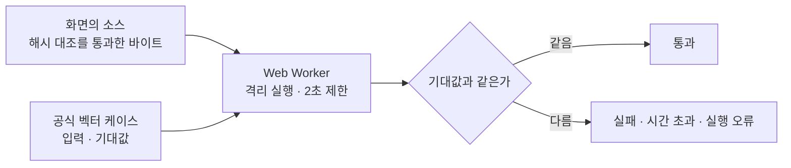
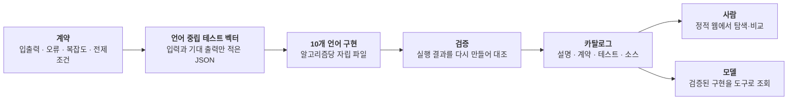

# SSW 알고리즘 아카이브

**알고리즘 500종을 10개 언어로 구현하고, 언어 중립 테스트 벡터로 5,000개 구현 전부가 같은
계약을 지키는지 확인한 아카이브입니다.** 이 사이트는 그중 8종을 잘라 낸 공개 스냅샷입니다.

시작은 제품이 아니라 **세 가지 궁금증**이었습니다. 오픈 웨이트 소형 모델에 코드를 맡기면
어디까지 되는지, 같은 작업을 500종 × 10개 언어로 벌리면 속도와 토큰이 얼마나 드는지, 그리고
이름만 알던 알고리즘들을 이 기회에 제대로 알 수 있는지. 이 사이트는 그 실험이 무엇이었고
무엇을 남겼는지 보여 주는 창구입니다.

읽기만 하는 창구는 아닙니다. **JavaScript 구현은 화면에서 그대로 돌려 볼 수 있습니다** —
공식 테스트 벡터의 케이스를 입력으로 넣고, 결과가 그 케이스의 기대값과 같은지 브라우저가
그 자리에서 대조합니다([3절](#3-브라우저에서-그-자리에서-돌려-본다)).

> **공개 사이트 주소** — https://s-work-agency.github.io/ssw-algorithm-archive-public/
> 이 저장소가 그대로 서빙됩니다.

---

## 1. 세 가지 목적

| | 궁금했던 것 | 그래서 만든 것 |
|---|---|---|
| ① | 오픈 웨이트 소형 모델에 코드를 맡기면 어디까지 될까 | 모델이 그 자리에서 지어내는 대신 **검증된 구현을 꺼내 쓰게** 하는 구조 |
| ② | 같은 일을 500종 × 10개 언어로 벌리면 속도와 토큰이 얼마나 들까 | 3개 언어 시범에서 시작해 **5,000개 구현**까지 실제로 벌린 파이프라인 |
| ③ | 이름만 알던 알고리즘을 제대로 알 수 있을까 | **계약을 적지 못하면 한 종도 넘어가지 못하는** 등재 절차 |

### ① 오픈 웨이트 소형 모델과 연동해 본다

소형 모델은 알고리즘 코드를 빠르게 써 냅니다. 문제는 그다음입니다 — 그 코드가 맞는지 매번
사람이 다시 확인해야 하고, 확인 비용이 생성 비용보다 큽니다. 그래서 방향을 뒤집었습니다.
**모델이 즉석에서 지어내게 하는 대신, 이미 검증을 통과한 구현을 골라 꺼내 쓰게** 하는
쪽입니다.

이 방향이 성립하려면 아카이브가 두 가지를 갖춰야 합니다. 하나는 **꺼내 쓸 단위**입니다.
한 알고리즘은 한 파일에 담고, 그 파일만 건네받아도 다른 파일 없이 동작해야 합니다. 다른
하나는 **거절할 줄 아는 경계**입니다. 없는 것을 그럴듯하게 채워 주는 도구는 모델의 실수를
줄이는 게 아니라 늘립니다.

### ② 3개 언어에서 10개 언어 · 500종으로 벌려 본다

처음은 C# · Java · JavaScript 세 언어로 가볍게 시작했습니다. 이 셋을 고른 데는 이유가
있습니다 — **정적 강타입 · JVM · 동적**이라는 축이 서로 충분히 달라서, 계약에 빈틈이 있으면
세 언어 사이에서 먼저 드러납니다.

그다음 궁금해진 것이 규모였습니다. 같은 일을 500종 × 10개 언어 = **5,000개 구현**으로
늘리면 얼마나 걸리고 얼마나 드는가. 실제로 벌려 보니 비용보다 먼저 걸린 것은 **구조**였습니다.
언어가 열 개가 되는 순간 "이 언어에서는 이렇게 나오던데"라는 말이 통하지 않게 되고, 계약이
정하지 않은 자리는 전부 언어의 기본값이 대신 결정해 버립니다.

생성 자체는 기대보다 빨랐습니다. 비싼 쪽은 열 개 언어의 구현을 서로 어긋나지 않게 맞추는
일이었고, 가볍게 시작해 규모부터 키운 설계 판단의 몫도 있어 **확장은 5,000개에서
멈춥니다**([실험 노트](docs/experiment-notes.md#우선은-5000에서-멈춘다)).

### ③ 몰랐던 알고리즘을 겸사겸사 공부한다

이름은 들어 봤지만 직접 써 본 적 없는 알고리즘이 목록의 절반이었습니다. 이 아카이브는 등재
절차가 **계약 먼저**라, "대충 안다"로는 한 종도 넘어가지 못합니다. 입력의 경계값, 오류
코드, 동점일 때 누가 먼저인지, 부동소수를 어디서 반올림하는지를 문장으로 적어야 그다음
단계로 갑니다.

덕분에 알게 된 것이 두 가지입니다. 하나는 **안다고 생각한 것이 대부분 안 적힌다**는 것,
다른 하나는 같은 알고리즘을 열 개 언어로 옮기면 알고리즘이 아니라 **그 언어의 관용**이
보인다는 것입니다.

자세한 관찰은 [실험 노트](docs/experiment-notes.md)에 있습니다.

---

## 2. 이 사이트에서 볼 수 있는 것

공개 스냅샷에는 **알고리즘 8종 × 3개 언어(C# · Java · JavaScript) = 24개 구현**이 들어
있습니다. 각 알고리즘마다 설명 · 계약 · 실제 테스트 케이스 · 언어별 원본 소스를 한 화면에서
볼 수 있습니다.

| 알고리즘 | 분류 | 짝 |
|---|---|---|
| 퀵 정렬 | 정렬 | 비교 기반 정렬 |
| 버블 정렬 | 정렬 | 가장 단순한 비교 정렬 — 위와 같은 출력, 다른 방법 |
| 계수 정렬 | 정렬 | 비교하지 않는 정렬 — 위 둘과 대조 |
| 너비 우선 탐색 | 그래프 | 같은 그래프를 훑는 두 갈래 |
| 깊이 우선 탐색 | 그래프 | 〃 |
| A* | 그래프 | 휴리스틱으로 유망한 쪽부터 — 위 둘의 확장 |
| KMP | 문자열 | 패턴 하나 찾기 |
| 아호 코라식 | 문자열 | 패턴 여럿을 한 번에 — 위와 대조 |

**8종이 서로 짝이 되게 놓여 있습니다.** 알고리즘 하나를 혼자 보는 것보다, "이건 되는데 저건
왜 안 되는가"를 나란히 놓고 보는 편이 계약의 성격 차이를 드러내기 때문입니다. 정렬 세 종이
그 예입니다 — 셋 다 **출력은 오름차순 `values` 하나**로 같지만, 거기까지 가는 방법도 계약이
입력에 거는 조건도 다릅니다. 계약이 **무엇을 보장하는지**만 말하고 **어떻게 하는지**는 말하지
않는다는 사실이 나란히 놓았을 때 드러납니다.

여기 실린 **공식 테스트 케이스는 70건**입니다. 세 언어가 같은 케이스를 공유하므로 스냅샷이
싣고 있는 검사는 **210건**이고, 실패는 0건입니다.

화면은 **목록 · 커버리지 · 상세** 셋입니다. 목록에서 고르고, 상세에서 계약 · 테스트 · 언어별
소스를 보고, 커버리지에서 종별 벡터 · 케이스 수를 한 표로 봅니다.

서버는 없습니다. 배포 루트에 놓인 **정적 파일 한 벌**이 전부이고, 상세 · 소스 본문 · 공식
벡터까지 전부 정적 파일로 함께 실려 있습니다. 화면은 파일을 받을 때마다 **인덱스가 발표한
sha256과 byteLength에 받은 바이트가 정확히 일치하는지** 확인하고, 어긋나면 코드 표시도 복사도
실행도 하지 않습니다. 헤더는 서버가 말하는 것이고 해시는 바이트가 말하는 것이라, 무결성
판정으로는 이쪽이 더 강합니다.

이 사이트는 **일회성 스냅샷**입니다. 본체가 갱신돼도 따라가지 않습니다. 화면 안내와 읽는
순서는 [샘플 안내](docs/sample-guide.md)에 있습니다.

> 본체 구현과 콘텐츠(알고리즘 소스 · 계약 · 테스트 벡터)는 비공개 저장소에 있습니다. 이
> 저장소에는 공개 스냅샷과 이 문서들만 담습니다.

---

## 3. 브라우저에서 그 자리에서 돌려 본다

상세 화면의 **JavaScript 소스 카드에는 실행기가 붙어 있습니다.** 화면에 떠 있는 그 소스를
브라우저에서 그대로 돌리고, 입력은 **공식 벡터의 케이스**를 씁니다. 결과는 그 케이스가
선언한 기대값과 대조합니다.

- 돌아가는 바이트는 **화면이 무결성 검사를 통과해 받아 둔 소스 그 자체**입니다. 실행하려고
  따로 받아오지 않습니다. 눈에 보이는 코드와 실제로 도는 코드가 같다는 것이 이 기능의 전제라,
  둘을 다른 경로로 두지 않았습니다.
- 실행은 **Web Worker 안에서만** 일어납니다. 화면 DOM에 손댈 수 없고, 무한 루프가 나도 UI
  스레드가 멈추지 않습니다. **2초를 넘기면 워커를 종료**합니다 — 협조를 구하는 신호가 아니라
  강제 종료라 `while (true)`도 실제로 끊깁니다.
- 입력 JSON은 **고쳐서 다시 돌릴 수 있습니다.** 케이스를 그대로 돌리면 기대값 대조가 되고,
  값을 바꿔 돌리면 계약이 무엇을 거절하는지 직접 밟아 볼 수 있습니다. 고쳐 돌린 결과에는
  "기대값은 원래 케이스의 것"이라는 표시가 함께 붙습니다.
- 판정은 느슨하지 않습니다. 출력 케이스는 값이 정확히 같아야 하고, 오류를 기대하는 케이스는
  **계약이 선언한 오류 코드까지 같아야** 통과입니다. 아무 예외나 났다고 통과시키면 오류
  계약을 검사하지 않는 것과 같습니다.

이 기능은 [목적 ①](#1-세-가지-목적)과 곧장 이어집니다. "생성 대신 검증된 구현을 꺼내 쓴다"가
성립하려면 **꺼낸 코드가 계약대로 도는지 보는 비용이 0에 가까워야** 합니다. 소스를 내려받아
프로젝트에 붙여 보고 나서야 확인이 되는 구조라면, 사람도 모델도 결국 다시 검증 비용을
치릅니다. 여기서는 읽던 화면에서 확인이 끝납니다.

브라우저가 그대로 돌릴 수 있는 언어가 JavaScript뿐이라 실행기는 그 카드에만 붙습니다. 나머지
두 언어는 파이프라인이 남긴 검증 결과 요약으로 확인합니다.

---

## 4. 전체 그림

순서가 뒤집히지 않는 것이 요점입니다. **구현이 먼저 나오고 테스트가 따라오면**, 테스트는
구현이 이미 하는 일을 확인해 줄 뿐입니다. 벡터를 계약에서 먼저 뽑아 두면 구현이 거기에
맞춰야 합니다.

이 공개 사이트는 그림의 **사람 쪽 갈래만 잘라 온 정적 사본**입니다. 여기에는 조회 API도
서버도 없고, 정적 파일과 브라우저의 바이트 대조가 전부입니다. 모델 쪽 갈래는 이 스냅샷의
일부가 아니라, 아카이브를 그렇게 설계한 이유([목적 ①](#1-세-가지-목적))로만 읽어 주시면
됩니다.

---

## 5. "검증됐다"가 무슨 뜻인가

이 프로젝트에서 검증은 **테스트를 돌렸다**가 아니라 **결과 바이트가 그대로다**입니다.

1. 알고리즘마다 **언어 중립 JSON 벡터**가 입력과 기대 출력(또는 기대 오류)을 정의합니다.
   벡터는 언어를 모릅니다 — 그래서 10개 언어가 같은 벡터를 씁니다.
2. 언어별 러너가 벡터를 실행해 결과 문서를 남기고, 이 결과 파일은 저장소에 커밋되어 있습니다.
3. 검증은 결과를 **다시 생성해 커밋된 파일과 대조**합니다. 한 바이트라도 다르면 실패입니다.
   "테스트가 통과했다"가 아니라 **"동작이 예전과 완전히 같다"**를 증명하는 구조입니다.

같은 벡터를 열 개 언어가 공유하기 때문에 **"Java에서는 되는데 Python에서는 안 된다"가 말이
되지 않습니다.** 둘 다 같은 입력에 같은 출력을 내야 하고, 다르면 구현이 아니라 계약이
모호했던 것이므로 계약을 고칩니다.

이 스냅샷에서는 같은 벡터를 **읽는 사람이 브라우저에서 다시 돌려 볼 수 있습니다**(3절).
"검증됐다"는 문장을 믿어 달라고 하는 대신, 그 문장이 무엇을 확인한 결과인지 직접 밟아 볼 수
있게 한 셈입니다.

상세는 [검증 파이프라인](docs/verification-pipeline.md).

---

## 6. 굳어진 판단 몇 가지

- **알고리즘당 자립 파일** — 한 알고리즘은 한 파일에 담고, 그 파일만 복사해도 다른 파일 없이
  동작해야 합니다. 초기에는 여러 알고리즘을 묶음 파일에 모아 두었는데, 그러면 하나를 꺼내
  쓰려고 묶음 전체를 들고 가야 합니다. "복사해 쓸 수 있는 단위"가 곧 "모델에게 건넬 수 있는
  단위"라, 묶음은 편의가 아니라 목적에 대한 방해였습니다.

- **결정적으로 검증할 수 없는 후보는 넣지 않는다** — 채택 기준은 "실제 시계 · OS 난수 ·
  스레드 없이 결정적으로 재현할 수 있는가"입니다. 통과하지 못하면 넣지 않습니다. 경계를
  가르는 것은 알고리즘의 난이도가 아니라 **갈릴 자리를 계약으로 막을 수 있는가**입니다.

- **시간 · 난수 · 외부 관측값은 전부 주입받는다** — 구현은 OS 시계도 OS 난수도 읽지 않습니다.
  그래서 캐시 만료나 재시도 지연처럼 시간에 기대는 알고리즘도 결정적으로 검증됩니다.

- **결정적 산출물** — 생성되는 산출물에 **생성 시각이나 환경 경로 같은 가변값을 넣지
  않습니다.** 같은 입력은 항상 같은 바이트를 만들고, 그래서 diff가 "무언가 바뀌었다"가 아니라
  "내용이 바뀌었다"를 뜻하게 됩니다.

- **구현과 검증은 다른 세션이 맡는다** — 한 세션이 자기 코드를 검증하면 구현할 때 한 착각을
  검증에서도 그대로 반복합니다. 검증 대상이 곧 산출물인 이 프로젝트에서는 특히 그렇습니다.

- **검색에 RAG를 붙이지 않았다** — 500개 구조화 항목 규모에서는 정규화 + 가중 부분 일치가
  결정적이고 충분합니다. 벡터 저장소 · embedding 모델 · 동기화라는 상시 비용을 지불하기
  전에, 검색 실패 로그로 필요를 먼저 확인하기로 했습니다.

---

## 7. 문서

| 문서 | 역할 |
|---|---|
| [실험 노트](docs/experiment-notes.md) | 세 가지 목적별 관찰 — 모델에 무엇을 맡길지, 규모를 벌리면 무엇이 부러지는지, 계약을 적으며 배운 것 |
| [검증 파이프라인](docs/verification-pipeline.md) | 계약 → 벡터 → 러너 → 바이트 동일성 · 계약 설계 관례 · CI · 브라우저까지 이어지는 대조 |
| [샘플 안내](docs/sample-guide.md) | 이 사이트에 담긴 8종 × 3언어가 무엇이고, 화면에서 무엇을 어떤 순서로 보면 되는지 |
