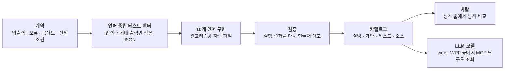
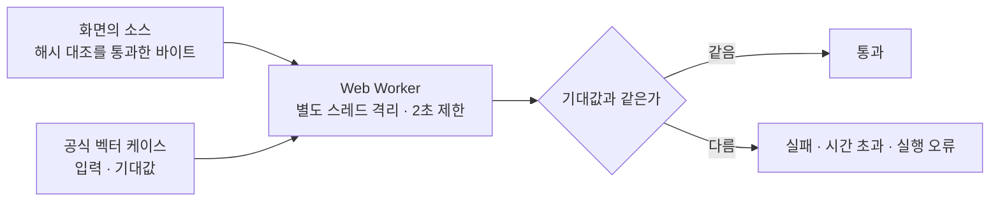

# SSW 알고리즘 아카이브

**알고리즘 500종을 10개 언어로 구현하고, 언어 중립 테스트 벡터로 5,000개 구현 전부가 같은
계약을 지키는지 확인한 아카이브입니다.**

> 이 사이트는 그중 **8종을 잘라 낸 공개 스냅샷**입니다.
> **JavaScript 구현은 화면에서 그대로 돌려 볼 수 있습니다.** 공식 테스트 벡터의 케이스를
> 입력으로 넣고, 결과가 그 케이스의 기대값과 같은지 브라우저에서 확인할 수 있습니다.

아카이브를 시작한 이유와 규모를 늘리면서 겪은 일을 정리했습니다. 처음에는 검증된 코드를
소형 모델이 얼마나 잘 활용할 수 있는지 궁금했고, 알고리즘을 공부하려는 목적도 있었습니다.
이후에는 규모를 늘렸을 때 작업 속도와 비용이 어떻게 달라지는지도 살펴봤습니다.
공개된 알고리즘부터 보고 싶다면
[8절](#8-이-사이트에-이것을-담았습니다)로 건너뛰어도 됩니다.

<!-- site-only-skip-start -->

> **공개 사이트**는 https://s-work-agency.github.io/ssw-algorithm-archive-public/ 에서
> 볼 수 있습니다. 이 저장소가 그대로 서빙됩니다.

<!-- site-only-skip-end -->

---

## 1. 가볍게 시작했습니다

시작은 두 가지 궁금증이었습니다. 하나는 **이미 구현되고 검증된 코드를 참조하게 하면 오픈
웨이트 소형 모델이 그것을 얼마나 잘 활용할 수 있을까**, 다른 하나는 **이름만 알던 알고리즘을
이 기회에 제대로 알 수 있을까**였습니다. 개인적으로 궁금해서 시작한 작업이라 처음부터
제품을 만들거나 큰 규모로 확장할 계획은 없었습니다.

**다른 작업과 병행**하면서 AI에 **개요 수준의 기획만** 전달하고 진행하게 뒀습니다.
처음에는 **알고리즘 100종 정도 × 3개 언어**를 **단일 저장소 하나**에 넣었습니다.
이 시기의 작업 시간은 **재지 않았습니다.** 다른 작업과 함께 진행했기 때문입니다.
이 규모에서 구현과 검증이 진행되는 것을 보고, 규모를 더 늘려 보기로 했습니다.

---

## 2. 코드를 새로 짜게 하지 않고 꺼내 쓰게 했습니다

소형 모델은 알고리즘 코드를 빠르게 써 냅니다. 하지만 그 코드가 맞는지는 사람이 확인해야
하고, **확인 비용이 생성 비용보다 큽니다.** 같은 알고리즘을 매번 새로 작성하게 하면 검증도
반복해야 합니다. 이 반복을 줄이려고 이미 검증된 코드를 참조하도록 해 봤습니다.

아카이브는 소형 모델이 **참조할 자료**로 만들었습니다. 소형 모델이 상황에 맞는 알고리즘을
고르고 검증된 코드를 꺼내 쓰도록 하려는 목적입니다.

아카이브를 만드는 일은 여러 AI 도구로 진행했고, 소형 모델은 완성된 자료를 상황에 맞게 골라
꺼내 쓰는 쪽입니다.

아카이브를 참조 자료로 쓰려면 구조도 그 목적에 맞아야 했습니다. **한 알고리즘은 한 파일에
담고, 그 파일만 건네받아도 다른 파일 없이 동작해야** 합니다. 요청한 알고리즘 하나 대신 옆
알고리즘 열 개가 딸려 오는 응답은 쓸모가 없기 때문입니다.

---

## 3. 세 언어로 먼저 검증했습니다

처음은 C# · Java · JavaScript 세 언어였습니다. 셋을 고른 데는 이유가 둘 있습니다. 하나는
**가장 많이 다뤄 본 언어들**이라는 점입니다. 처음 밟는 절차를 손에 익지 않은 언어로 시작하면,
결과가 어긋났을 때 계약이 모호한 것인지 그 언어를 몰라서인지 구분되지 않습니다. 다른 하나는
**정적 강타입 · JVM · 동적**이라는 축이 서로 충분히 달라서, 계약에 빈틈이 있으면 세 언어
사이에서 먼저 드러난다는 점입니다.

이 프로젝트에서는 계약을 정리하는 데 작업이 가장 많이 들었습니다. 알고리즘 하나를 추가할
때 구현에 앞서 **입력 · 출력 · 오류 코드 · 복잡도 · 전제조건**을 문서로 정했습니다.
입력 범위, 실패 시 오류, 동점 처리 기준, 출력 순서의 의미까지 정해야 구현을 시작할 수
있었습니다.

계약에서 테스트 벡터를 만들고, 언어별 구현이 그 벡터를 통과하는지 확인했습니다.

```mermaid
flowchart LR
    C["<b>계약</b><br/>입출력 · 오류 · 복잡도 · 전제조건"]
    V["<b>언어 중립 테스트 벡터</b><br/>입력과 기대 출력만 적은 JSON"]
    I["<b>10개 언어 구현</b><br/>알고리즘당 자립 파일"]
    R["<b>검증</b><br/>실행 결과를 다시 만들어 대조"]
    K["<b>카탈로그</b><br/>설명 · 계약 · 테스트 · 소스"]
    H["<b>사람</b><br/>정적 웹에서 탐색·비교"]
    M["<b>LLM 모델</b><br/>web · WPF 등에서 MCP 도구로 조회"]

    C --> V --> I --> R --> K
    K --> H
    K --> M
```

테스트를 구현에 맞춰 작성하면 구현의 실수를 그대로 놓칠 수 있습니다. 그래서 **계약에서
테스트 벡터를 먼저 만들고**, 구현을 그 기준에 맞췄습니다. 테스트 벡터는 특정 언어에
묶이지 않아 열 개 언어가 함께 사용합니다. 같은 입력에 출력이나 오류가 다르면 구현에
결함이 있는지, 계약이 모호한지 확인했습니다.

언어별 러너가 테스트 벡터를 실행한 결과는 저장소에 커밋해 두었습니다. 검증할 때마다
결과를 **다시 생성해 커밋된 파일과 바이트 단위로 대조**합니다. 한 바이트라도 다르면
실패로 처리합니다.

아카이브에 넣는 알고리즘은 **실제 시계 · OS 난수 · 스레드 없이 같은 결과를 재현할 수
있어야** 합니다. 시간과 난수는 호출자가 입력하도록 해 캐시 만료나 재시도 지연도
같은 조건으로 검증할 수 있게 했습니다.

---

## 4. 가장 중요한 것은 계약이라고 생각합니다

알고리즘을 안다고 생각해도 **입출력과 예외 조건을 계약으로 적을 때는 모호한 부분이
많았습니다.** 예를 들어 "최단 경로를 구한다"는 설명만으로는 최단 경로가 여럿일 때
어느 것을 반환할지 알 수 없습니다. 이 기준을 미리 정하지 않으면 나중에 구현을 고쳐야
합니다.

알고리즘 풀이는 보통 주어진 문제를 풀고 정답지를 맞춰 보는 형태로 연습합니다. 하지만
실무에서 가장 중요한 것은 그 문제 자체를 출제하는 능력이라고 생각합니다. 어떤 상황에서
어떤 알고리즘을 쓸지 정해진 상태에서 푸는 풀이는 코더로서의 능력을 올릴 수는 있어도,
프로그래머라는 관점에서는 반쪽짜리 연습입니다. **계약을 적는 일이 바로 그 출제에
해당합니다.**

구현 속도가 빨라도 입력 범위나 예외 조건을 빼먹으면 수정 작업을 반복하게 됩니다.
예외가 적고 단순한 구현은 소형 모델로도 충분하지만, 복잡한 구현은 요구사항과 위험을
판단하는 데 더 많은 추론이 필요합니다. 더 많은 컴퓨팅 자원을 쓰는 큰 모델을
고르는 이유입니다.

---

## 5. 그다음 궁금해진 것은 규모였습니다

이 실험의 시작은 **예고된 주간 사용 한도 리셋**이었습니다. 한도가 리셋되는 김에
규모를 늘려 보게 됐습니다.
**500종 × 10개 언어 = 5,000개 구현을 만들면 시간이 얼마나 걸리고 토큰은 얼마나
들까** 하는 궁금증이 생겼습니다.

그래서 **단일 저장소 하나에 전부 넣어 두던 구조를 언어별 저장소로 분할**하고, 알고리즘
100종 남짓을 500종으로, 3개 언어를 10개 언어로 한꺼번에 올렸습니다.

500종 × 10개 언어로 확장한 작업은 **약 3~4일** 걸렸습니다. 작업을 돌려 놓고 일상생활을
했고, 수면을 취하는 동안에도 작업은 계속 진행됐습니다. 작업 중 제가 한 일은 빌드나 테스트로
쌓이는 임시 폴더를 정리하고, 장시간 빌드와 테스트를 반복하면서 **원인 불명의 메모리 누수와
디스크 I/O 부하**가 누적되면 **한 번씩 재부팅**하는 것이었습니다.

여러 세대의 도구와 모델을 섞어 사용했기 때문에 총 토큰이나 모델별 성능을 정확히
비교하기는 어렵습니다.

**속도는 기대보다 빨랐습니다.** 전체 구현 **5,000개 중 100개를 한 묶음으로** 처리했고,
한 묶음을 마치는 데 **30분에서 한 시간** 정도가 걸리기도 했습니다.
다만 **모델에 따라 차이가 컸으므로**, 이 수치를 평균 처리 시간으로 보기는
어렵지만, **사용 시나리오 작성 · 구현 · 주석 · 테스트 코드 작성 · 테스트 통과**까지
포함한 시간입니다.

---

## 6. 언어별 동작을 맞추는 데 시간이 많이 들었습니다

규모를 늘리면서 시간과 토큰이 많이 든 작업은 **열 개 언어의 구현이 같은 동작을 하도록
맞추는 일**이었습니다. 개별 알고리즘의 구현은 대체로 빨리 끝났지만, 언어 사이에서 결과가
달라지는 문제를 확인하고 고치는 데 시간이 들었습니다.

입력 범위나 오류 조건을 명확히 정하지 않으면 **언어의 기본값에 따라 동작이 달라졌습니다.**

예를 들어 입력 조건을 **“양의 정수”**라고만 정하면 구현마다 선택한 자료형과 검사 방식에
따라 허용 범위가 달라질 수 있습니다. C#과 Java에서 `int`를 쓰면 부호 있는 32비트 정수
범위로 제한되지만, JavaScript의 기본 숫자형 `Number`는 **부호 있는 64비트 부동소수점**입니다.
JavaScript에서 양수인지와 정수인지 여부만 검사하면 **2147483648처럼 32비트 정수 범위를
넘는 입력**도 허용할 수 있습니다.

계약에는 **허용하는 값의 범위를 숫자로** 정해야 했습니다. 예를 들어 **1부터 2147483647까지**로
정했다면 모든 언어의 구현에서 같은 범위를 검사해야 했습니다. 이 기준을 뒤늦게 정한
경우에는 이미 작성한 열 개 언어의 구현을 다시 확인해야 했습니다.

저장소 구조도 바꿨습니다. 초기에는 여러 언어의 구현을 **단일 레포에 모아 관리하는
모노레포(monorepo) 형식**이었습니다. 규모를 늘리는 과정에서 **언어별 레포로 나눴습니다.**

이후에는 **계약을 먼저 정하고, 처음 보는 계약 형태는 한 종을 끝까지 검증한 뒤 나머지를
만들었습니다.** 새 알고리즘은 세 언어로 먼저 구현했습니다. AI 세션도 **구현과 검증을 나눠
맡도록 했습니다.** 같은 세션에서 둘 다 진행하면 구현할 때 잘못 이해한 내용을 테스트에도
반영할 수 있기 때문입니다.

---

## 7. 500종 × 10개 언어 = 5,000개 구현에서 확장을 멈췄습니다

대규모 작업에서의 토큰 사용량을 체감하고, 에이전트에게 장시간 작업을 맡기는 방식을
실험해 보고 싶었습니다.

5,000개의 구현은 많은 양이지만, 이번 작업에서는 **구현 개수 자체에 의미를 두지는
않았습니다.** 이번 작업의 핵심은 **여러 에이전트를 동시에 오래 실행했을 때 토큰 소모와
작업 속도, 컴퓨터의 자원 사용량이 어떻게 달라지는지 살펴보는 것**이었습니다.

**Claude · GPT · Grok**을 함께 쓰면서
**서브에이전트를 동시에 최대 50개까지** 띄워 봤고, 이때 **CPU · 메모리 · I/O를 거의
최대로 사용했습니다.**

이 경험을 통해 GPU뿐 아니라 모든 컴퓨팅 자원이 앞으로 더 중요해질 것이라는 생각이 들었습니다.

---

## 8. 이 사이트에 이것을 담았습니다

공개 스냅샷에는 **알고리즘 8종 × 3개 언어(C# · Java · JavaScript) = 24개 구현**이 들어
있습니다. 각 알고리즘마다 설명 · 계약 · 실제 테스트 케이스 · 언어별 원본 소스를 한 화면에서
볼 수 있습니다.

| 알고리즘 | 분류 | 짝 |
|---|---|---|
| 퀵 정렬 | 정렬 | 비교 기반 정렬 |
| 버블 정렬 | 정렬 | 가장 단순한 비교 정렬. 위와 같은 출력, 다른 방법 |
| 계수 정렬 | 정렬 | 비교하지 않는 정렬. 위 둘과 대조 |
| 너비 우선 탐색 | 그래프 | 같은 그래프를 훑는 두 갈래 |
| 깊이 우선 탐색 | 그래프 | 〃 |
| A* | 그래프 | 휴리스틱을 이용한 가중 최단 경로 탐색. BFS·DFS와 탐색 기준 대조 |
| KMP | 문자열 | 패턴 하나 찾기 |
| 아호 코라식 | 문자열 | 패턴 여럿을 한 번에. 위와 대조 |

정렬 · 그래프 · 문자열 알고리즘을 서로 비교해 볼 수 있도록 골랐습니다. 예를 들어 정렬
세 종은 **출력이 오름차순 `values` 하나**로 같지만, 구현 방법과 입력 조건은 다릅니다.
같은 결과를 내는 알고리즘 사이에 어떤 차이가 있는지 함께 볼 수 있습니다.

여기 실린 **공식 테스트 케이스는 70건**입니다. 세 언어가 같은 케이스를 공유하므로 스냅샷이
싣고 있는 검사는 **210건**이고, 실패는 0건입니다.

> 이 사이트는 **일회성 스냅샷**입니다. 본체가 갱신돼도 따라가지 않고, 이 저장소에는 공개
> 스냅샷과 이 문서들만 담습니다.

---

## 9. 브라우저에서 직접 실행합니다

상세 화면의 **JavaScript 소스 카드에는 실행기가 붙어 있습니다.** 화면에 떠 있는 그 소스를
브라우저에서 그대로 돌리고, 입력은 **공식 벡터의 케이스**를 씁니다. 결과는 그 케이스가
선언한 기대값과 대조합니다.

```mermaid
flowchart LR
    S["화면의 소스<br/>해시 대조를 통과한 바이트"]
    C["공식 벡터 케이스<br/>입력 · 기대값"]
    W["Web Worker<br/>별도 스레드 격리 · 2초 제한"]
    J{"기대값과 같은가"}
    P["통과"]
    F["실패 · 시간 초과 · 실행 오류"]

    S --> W
    C --> W
    W --> J
    J -->|같음| P
    J -->|다름| F
```

- 실행하는 코드는 **무결성 검사를 통과해 화면에 표시한 소스와 같습니다.** 실행용 코드를
  별도로 받아오지 않습니다.
- 실행은 **브라우저에 내장된 별도 스레드(Web Worker 표준 API) 안에서만** 일어납니다. 워커
  스크립트는 받아 둔 소스로 만들기 때문에 추가 요청이 필요하지 않습니다.
  화면을 그리는 스레드와 분리돼 있어 DOM에 손댈 수 없고,
  무한 루프가 돌아도 화면이 멈추지 않습니다. **2초를 넘기면 밖에서 워커를 종료**합니다.
  워커를 강제로 종료하므로 `while (true)`도 중단됩니다.
- 선택한 케이스의 **입력 값과 기대값은 위에 나란히 표시**하고, 그 아래의 입력 JSON은
  **고쳐서 다시 돌릴 수 있습니다.** 실행 결과는 편집 영역 아래에 표시합니다.
  케이스를 그대로 돌리면 기대값 대조가 되고,
  값을 바꿔 돌리면 계약이 무엇을 거절하는지 직접 밟아 볼 수 있습니다. 고쳐 돌린 결과에는
  **“입력 값 변경”** 표시가 붙고, 원래 케이스의 기대값은 참고용으로 보여 줍니다.
  수정한 입력은 그 기대값으로 통과 · 실패를 판정하지 않습니다.
- 출력 케이스는 값이 정확히 같아야 하고, 오류를 기대하는 케이스는
  **계약이 선언한 오류 코드까지 같아야** 통과입니다. 아무 예외나 났다고 통과시키면 오류
  계약을 검사하지 않는 것과 같습니다.

> 덧붙이면 이 기능은 원래 계획에 없었습니다. AI 에이전트의 제안을 받아 추가했습니다.

브라우저 실행기는 JavaScript 카드에 제공하고, 나머지 두 언어는 파이프라인에서 통과한
검증 결과 요약을 보여 줍니다.

---

## 10. 더 읽기

| 문서 | 역할 |
|---|---|
| [알고리즘이라는 것](docs/algorithm-thoughts.md) | 알고리즘에 대한 생각과 아카이브의 설계 방향 |
| [실험 노트](docs/experiment-notes.md) | 조회 도구의 요건, 규모를 늘릴 때의 절차, 계약을 작성하며 배운 것 |
| [검증 파이프라인](docs/verification-pipeline.md) | 계약 → 벡터 → 러너 → 바이트 동일성 · 계약 설계 관례 · CI · 브라우저까지 이어지는 대조 |
| [샘플 안내](docs/sample-guide.md) | 이 사이트에 담긴 8종 × 3언어가 무엇이고, 화면에서 무엇을 어떤 순서로 보면 되는지 |
