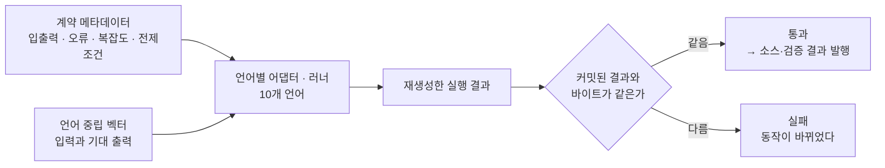
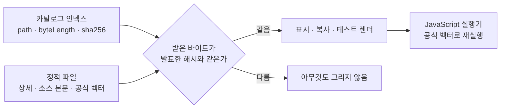

# 검증 파이프라인

이 프로젝트의 전제는 하나입니다 — **AI가 만든 코드는 검증을 통과하기 전까지 아카이브의
항목이 아니다.** 그래서 "검증"의 정의를 최대한 좁고 기계적으로 잡았습니다.

---

## 1. 파이프라인 전체



핵심은 마지막 마름모입니다. 대부분의 테스트는 "**단언이 통과했는가**"를 묻지만, 여기서는
"**결과 문서가 이전과 똑같이 재생성되는가**"를 묻습니다. 전자는 단언이 느슨하면 통과하고,
후자는 출력이 한 글자만 달라져도 걸립니다.

---

## 2. 계약이 먼저다

알고리즘 하나를 추가할 때 가장 먼저 쓰는 건 구현이 아니라 **계약 메타데이터**입니다.

| 항목 | 내용 |
|---|---|
| 분류 | 분류(category) · 계열(family) — 둘 다 닫힌 목록이 아닌 확장 지점 |
| 문서 | 요약 · 언제 쓰나 · 언제 피하나 · 트레이드오프 · 함정 |
| 계약 | 입력 · 출력 · 오류 코드 목록 · 입력 변이 규칙 |
| 복잡도 | 시간 · 공간 |
| 전제조건 | 예: "동률 f 점수는 정점 입력 순서를 따른다" |
| 언어별 진입점 | 언어마다 어떤 이름으로 노출되는가 |
| 대안 | 대안 알고리즘 — 상호 링크로 "이거 말고 저걸 써야 할 때"를 잇습니다 |

**오류도 계약입니다.** `INVALID_SOURCE`·`NEGATIVE_WEIGHT` 같은 코드를 미리 선언하고, 선언한
모든 오류가 실제 테스트 케이스에 등장하는지 검사기가 확인합니다. "오류 처리를 했다"고 적어
두고 아무도 그 경로를 밟지 않는 상태를 막기 위한 장치입니다.

전제조건이 중요한 이유는 다국어 아카이브이기 때문입니다. **정렬 안정성, 동률 처리 순서,
부동소수 허용 오차 같은 것을 계약에 못 박지 않으면 언어마다 결과가 갈립니다.** 그러면
"어느 쪽이 맞는가"를 매번 다시 논쟁하게 됩니다.

---

## 3. 계약을 설계할 때의 관례

처음 얼마간은 기존 계약을 흉내 내면 됐습니다. 알고리즘을 **새로** 설계하기 시작하면서
사정이 달라졌습니다. 계약이 갈릴 자리를 매번 다시 판단하면 판단이 사람마다 달라지고, 열 개
언어가 같은 답을 내지 못합니다. 그래서 앞서 자리 잡은 규칙을 뽑아 **관례 문서**를 정본으로
두었습니다. 새 정책을 발명한 게 아니라, 암묵적으로 지키던 것을 글로 고정한 것입니다.

### 시계와 난수는 주입받는다

분산 · 복원력 · 캐시 · 처리율 제한 계열은 **호출자가 시각과 난수를 넣습니다.** 구현은 OS
시계도 OS 난수도 읽지 않습니다.

- 이벤트 시각은 `atMs`, 정책 시간은 `ttlMs`·`resetTimeoutMs`·`baseDelayMs`처럼 **단위를
  이름에 박습니다.**
- 이벤트 스트림의 시각은 **비감소**이고, 같은 시각의 연속 이벤트는 허용합니다. 시계가
  뒤로 가면 계약 오류입니다.
- 난수는 주입 배열이거나 계약에 식이 적힌 고정 PRNG입니다. 필요한 난수가 모자라면 그것도
  선언된 오류입니다.

덕분에 "시간에 따라 동작하는 알고리즘"도 결정적으로 검증됩니다. 재시도 지터가 실제로
기다리지 않고 지연 시간 배열만 계산하는 것도 같은 이유입니다.

### 경계값은 숫자 구간으로 적는다

`lru-cache`의 capacity를 초기에 "positive integer"라고만 적었습니다. C#과 Java는 부호 있는
32비트로 막았고 JavaScript는 정수인지만 확인해서, **2147483648을 한쪽은 거절하고 한쪽은
받는** 상태가 생겼습니다. 계약이 모호하면 언어의 기본값이 대신 결정합니다.

그래서 새 계약은 `"positive signed 32-bit integer (1 through 2147483647)"`처럼 **구간을 숫자로**
씁니다. 더 큰 범위가 필요하면 JSON safe integer라고 명시적으로 올리고, 더 좁히면 이유를
전제조건에 적습니다. 언어별로 조용히 넓히는 것은 금지입니다.

### 동점은 반드시 한 방향으로 잠근다

출력 순서가 의미를 갖거나 동점 선택이 있으면 계약이 한 문장으로 정합니다. 최단경로의 동률은
정점 입력 순서, LFU 퇴거는 최저 빈도 → 가장 오래된 접근 → 키 순서, 만료 후 남은 항목은 키
오름차순, 접두사 조회는 코드 포인트 정렬. **로케일 정렬은 쓰지 않습니다** — 같은 코드가 다른
로케일에서 다른 답을 내면 아카이브의 전제가 무너집니다.

### 부동소수는 가능하면 피하고, 못 피하면 규칙을 적는다

우선순위는 이렇습니다. ① 정수 · 고정소수 · 십진 문자열로 계약해 교차 언어 비트 일치 부담을
없앤다. ② 실수가 불가피하면 **반올림 자릿수와 모드, 음수 0 정규화**를 전제조건에 쓰고 벡터의
기대값을 그 규칙대로 적는다. ③ "언어 기본 double 연산 결과 그대로"는 쓰지 않는다.

### 순수인지 상태형인지 먼저 정한다

판정 기준은 한 줄입니다 — **호출자가 여러 번에 걸쳐 같은 구조를 바꾸는 것이 도메인의 본질이면
상태형, 한 번의 순수 변환이면 순수.** 구현 편의를 위해 내부에 지역 변수를 쓰는 것은 이 판정을
바꾸지 않습니다. 구현 전에 정하지 않으면 언어마다 공개 API 모양이 갈립니다.

상태형은 **실사용용 상태 객체 API**와, 그 API를 순서대로 호출하는 **얇고 결정적인 배치
진입점**을 같은 파일에 둡니다. 두 소비자의 요구가 다르기 때문입니다 — 실제 프로젝트에 캐시를
가져다 쓰는 사람은 `get`/`put` 인스턴스 API가 필요하고, 검증 파이프라인은 "연산 시퀀스를 한
번에 넣으면 결과가 결정적으로 나오는" 진입점이 필요합니다.

### 검증할 수 없으면 넣지 않는다

채택 기준의 첫 줄은 "**결정적으로 검증 가능한가**"입니다. 실제 시계 · OS 난수 · 스레드를
쓰지 않고, 시간과 모든 연산을 호출자가 주입하는 형태로 번안할 수 있어야 합니다.

가장 분명한 탈락 사례가 유니코드 케이스 폴딩이었습니다. 넣고 싶었지만 고정 UCD 표를 함께
싣지 않으면 언어 기본 소문자화·정규화가 ß→ss · 리가처 · final sigma에서 갈립니다. 그 설계
없이 넣으면 **"언어마다 답이 다른 항목"이 아카이브에 하나 생기고, 그 하나가 나머지 전부의
신뢰를 깎습니다.** 고속 푸리에 변환도 같은 이유입니다 — 부동소수 오차가 플랫폼마다 갈려서,
고정소수나 정수 NTT로 계약을 바꾸기 전에는 넣지 않습니다.

### 관례가 있으면 갈릴 만한 것도 잠글 수 있다

반대로, 위 관례가 자리를 잡고 나자 한때 "언어마다 갈릴 것 같다"고 미뤄 두었던 후보들을
계약으로 잠가 발행할 수 있게 됐습니다. 막은 방식이 관례 항목과 그대로 대응합니다.

| 알고리즘 | 갈릴 뻔한 자리 | 계약으로 못 박은 것 |
|---|---|---|
| `huffman-coding` | 같은 빈도 노드를 힙에서 꺼내는 순서가 구현마다 달라 **코드표 자체가 달라진다** | 빈도 오름차순 → 최소 심벌 코드 포인트 순. 먼저 꺼낸 노드가 왼쪽(비트 0), 내부 노드의 대표 심벌은 두 자식 대표 심벌의 코드 포인트 최소 |
| `crc32` | "CRC-32"라는 이름 하나에 서로 다른 파라미터 조합이 여럿 있다 | CRC-32/ISO-HDLC로 고정 — poly · init · refin · refout · xorout을 전제조건에 박고 **호출자 입력으로 열지 않음** |
| 기하 계열 | 좌표를 실수로 받으면 교차·포함 판정이 플랫폼마다 갈린다 | 좌표를 정수 범위로 제한하고 비교를 **정수 산술로 환원** — 포함 판정은 정수 외적, 최근접쌍은 제곱거리 비교, 면적·무게중심은 정수 shoelace 합을 임의 정밀도로 누적한 뒤 **마지막 발행 단계에서만** 반올림 |
| `deadlock-detector` | 기본 순환을 나열하면 **탐색 시작점과 인접 순회 순서에 따라 목록이 달라진다** | 순환 나열 대신 wait-for 그래프의 비자명 SCC로 정의. 얽힌 순환은 한 집합으로 합치고, 집합 안팎 정렬을 코드 포인트 순으로 고정 |

공통점은 알고리즘의 난이도가 아닙니다. **갈릴 자리를 미리 찾아 한 방향으로 잠글 수 있는가**가
경계였고, 관례 문서가 그 자리를 찾는 체크리스트 역할을 했습니다. 기하 계열이 특히 분명한
사례입니다 — 부동소수 규칙을 정교하게 만드는 대신 **계약의 입력 타입을 바꿔 부동소수를 아예
없애는** 쪽이 관례 ①(가능하면 정수로 계약한다)의 직접적인 적용이었습니다.

---

## 4. 언어 중립 테스트 벡터

벡터는 언어를 모릅니다. 입력과 기대 출력(또는 기대 오류)을 순수 JSON 값으로만 적습니다.

- 한 케이스는 출력 또는 오류 중 **정확히 하나만** 기대할 수 있습니다.
- 알고리즘 · 벡터 · 케이스의 ID는 전부 소문자 kebab-case이고, **파일명과 내부 ID가 일치**해야
  합니다.
- 의도적으로 무효한 벡터는 따로 둡니다 — 검사기가 **거절하는 데 성공하는지**를 확인하기 위한
  fixture입니다.
- 큰 입력은 파일로 커밋하지 않고 **결정적 recipe**로 적어 둡니다. 검증 시점에 임시 디렉터리에
  materialize해 실제 어댑터로 돌린 뒤 지웁니다.

**같은 벡터를 10개 언어가 공유합니다.** 그래서 "Java에서는 되는데 Python에서는 안 된다"가
말이 되지 않습니다 — 둘 다 같은 입력에 같은 출력을 내야 하고, 다르면 계약이 모호했던
것이므로 계약을 고칩니다. 검증 언어를 늘려도 벡터는 늘지 않습니다.

---

## 5. 러너와 바이트 동일성

언어별 러너는 벡터를 실행해 결과 문서를 남깁니다.

```json
{"algorithmId":"binary-search","vectorId":"binary-search-basic",
 "runner":{"language":"csharp"},
 "results":[{"caseId":"finds-present-target","outcome":"passed","actual":{"index":2}}],
 "summary":{"passed":3,"failed":0,"skipped":0}}
```

세 outcome은 서로 배타적으로 기록됩니다 — `passed`는 `actual`만, `failed`는 `{code, message}`
형태의 `error`만, `skipped`는 payload 없이. 그리고 `summary`는 **실제 outcome 개수와 정확히
일치**해야 합니다. 요약만 손대서 초록불을 만드는 경로를 닫아 둔 것입니다.

이 결과 파일들이 저장소에 커밋되어 있고, 검증은 **전부 다시 생성해 커밋된 바이트와
대조**합니다. 리팩터링이 동작을 조금이라도 바꿨다면 diff가 생깁니다.

> 이 대조가 가장 크게 쓸모 있었던 자리는 **묶음 파일 해체**였습니다. 여러 알고리즘이 모여
> 있던 파일을 알고리즘당 자립 파일로 쪼개는 작업은 수백 개 파일을 건드리는데, 정작 동작은
> 한 톨도 바뀌면 안 됩니다. 작업 전후로 러너 결과 파일이 **한 바이트도 달라지지
> 않았습니다.** 리뷰어가 수백 개 파일을 눈으로 다 볼 필요가 없어집니다.

러너 최상위까지 올라온 예상 밖의 내부 예외는 정상 결과와 섞지 않고 별도 진단 문서로 기록하며,
종료 코드도 실패로 만듭니다. **계약이 정의한 오류**와 **러너가 깨진 사고**는 다른 사건이기
때문입니다.

---

## 6. 결정적 산출

파이프라인이 만드는 산출물에는 **생성 시각도, 생성 환경의 경로도 들어가지 않습니다.** 정렬된
입력을 읽고 고정된 규칙으로만 직렬화합니다. 결과는 이렇습니다.

- 같은 입력은 항상 **바이트 단위로 같은** 산출물을 만듭니다.
- 그래서 "산출물이 바뀌었다"는 diff가 곧 "**내용이 바뀌었다**"입니다. 노이즈가 없습니다.
- 여러 환경에서 생성한 결과를 내용 해시로 대조해 재현성을 확인할 수 있습니다.

이 성질이 공개 스냅샷까지 그대로 이어집니다. 산출물의 바이트가 고정되어 있으니 **바이트 해시를
발행해 둘 수 있고**, 받는 쪽이 그 해시로 검사할 수 있습니다(8절).

---

## 7. CI — 로컬과 같은 명령

CI의 성공 기준은 로컬 검증 명령과 **글자 그대로 같습니다.** CI 전용 스크립트를 따로 만들지
않은 건 의도적입니다. 둘이 갈라지는 순간 "로컬에서는 되는데 CI에서는 안 된다"가 **조사할
가치가 있는 신호가 아니라 일상**이 됩니다.

| 잡 | 하는 일 |
|---|---|
| 수직 잡 | 두 언어로 계약 하나를 먼저 확인 — 매트릭스 전체를 돌리기 전 조기 실패 |
| 매트릭스 드리프트 | 계약 메타데이터에서 활성 언어를 뽑아 워크플로의 매트릭스 열거와 대조 |
| 언어 매트릭스 | Java · JavaScript · C# · TypeScript · Python · Go · Rust · Kotlin · C++ · Ruby 각각의 표준 툴체인에서 실행 |

**매트릭스 드리프트 검사**가 이 CI의 핵심입니다. 언어를 하나 추가하고 워크플로 열거를 안
고치면, 새 언어는 조용히 검증 없이 지나가는 게 아니라 **CI가 실패합니다.** 누락 언어 ·
미지원 언어 · 중복 항목이 전부 실패 조건입니다.

각 언어 잡은 자기 언어의 fresh 결과만 요구하고, checkout에 남아 있는 다른 언어의 결과를
성공 조건으로 쓰지 않습니다. 그래서 언어를 추가해도 전체 스크립트를 중복 실행하지 않고
검증 범위만 독립 잡으로 늘어납니다. CI는 생성 결과를 커밋하거나 push하지 않습니다.

### 무엇을 검증하지 않는지도 적어 둔다

소비자 쪽 CI는 자기 저장소의 fixture로만 카탈로그를 소비합니다. 그래서 **상류가 계약을 바꿔도
소비자 CI는 초록입니다.** 앞서 언급한 "하드코딩된 언어 목록" 사고를 발견한 것도 CI가 아니라
사람이었습니다. 실제 카탈로그를 생성해 소비하는 잡을 붙이는 일은 별도 안건으로 올려 둔
상태입니다. **CI가 무엇을 검증하지 않는지도 문서에 적어 두는 편**이 초록불을 과신하는 것보다
낫다고 봤습니다.

---

## 8. 공개 스냅샷까지 이어지는 대조

지금까지는 파이프라인이 자기 저장소 안에서 하는 검사였습니다. 공개 스냅샷은 그 결과를 밖으로
내보내는 자리인데, **내보내는 순간 검사도 함께 끊기지 않게** 두 가지를 이어 붙였습니다.



### 받은 바이트를 브라우저가 다시 본다

공개 스냅샷은 **Archive API를 두지 않습니다.** 상세와 검색 보조뿐 아니라 소스 본문과 공식
벡터까지 배포 루트의 정적 파일로 함께 싣습니다. 대신 화면이 파일을 하나 받을 때마다 인덱스와
상세가 발표한 `byteLength` · `sha256`과 **정확히 일치하는 바이트만** 통과시킵니다.

- Content-Type 같은 헤더는 검사에 넣지 않습니다. 정적 서버마다 표기가 갈리고, **헤더는 서버가
  말하는 것이지만 해시는 바이트가 말하는 것**이라 무결성 판정으로는 이쪽이 더 강합니다.
- 대신 UTF-8 해독과 JSON 파싱을 fatal로 걸어 형태를 확정합니다.
- 검사를 통과하지 못하면 **코드 표시도 복사도 테스트 렌더도 일어나지 않습니다.** 실패를
  조용히 넘기고 빈 화면을 그리는 대신, 무엇이 준비되지 못했는지를 그 자리에 적습니다.

6절의 결정적 산출이 여기서 값을 합니다. 산출물 바이트가 고정이 아니면 해시를 발행할 수 없고,
발행할 수 없으면 받는 쪽이 검사할 방법도 없습니다.

### 같은 벡터를 브라우저가 다시 돌린다

JavaScript 소스 카드에는 실행기가 붙어 있습니다. 화면이 위 검사를 통과해 받아 둔 **그 소스
바이트**를 Web Worker에서 돌리고, 입력은 함께 실린 **공식 벡터의 케이스**를 씁니다. 결과는
그 케이스가 선언한 기대값 또는 기대 오류 코드와 대조합니다.

- 실행하려고 소스를 따로 받아오지 않습니다. **표시되는 코드와 도는 코드가 같은 바이트**여야
  "돌려 봤다"가 무언가를 증명합니다.
- Worker 격리라 화면 DOM에 손댈 수 없고, **2초를 넘기면 워커를 종료**합니다. 강제 종료라
  무한 루프도 실제로 끊깁니다.
- 판정은 러너와 같은 엄격도입니다 — 출력은 값이 정확히 같아야 하고, 오류 케이스는 **계약이
  선언한 코드까지** 같아야 통과입니다.

이 스냅샷에 실린 공식 케이스는 **70건**이고, 세 언어가 같은 케이스를 공유하므로 검사는
**210건**입니다. 실패 0건 · 건너뜀 0건이고, 그중 JavaScript 쪽 70건은 읽는 사람이 브라우저에서
직접 다시 밟아 볼 수 있습니다.

브라우저가 하는 이 대조는 파이프라인의 바이트 동일성 검사를 **대신하지 않습니다.** 러너 결과의
바이트 동일성은 여전히 저장소 안에서만 판정하고, 브라우저 쪽은 "발행된 것이 발행된 그대로
도착했고, 도착한 그것이 계약대로 돈다"까지를 확인합니다.
